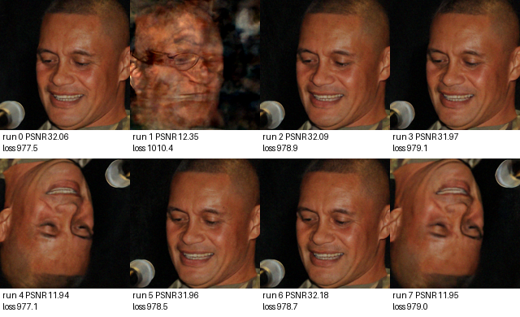

# B19 Prefix Policy Findings

This note summarizes the current B19 branch-B findings for DAPS phase retrieval with locked measurements.

## Leading policy

The current leading policy is:

- Run `K = 5` valid DAPS prefixes.
- Stop at checkpoint step `125 / 200`.
- Keep `2` prefixes by relative clean-free prefix score.
- Finish only the kept prefixes.
- Final-select by exact DAPS operator loss among the completed kept candidates.

The relative prefix score is:

    rank(sqrt_loss_x0y_over_y_norm) + rank(correction_rms)

Ranks are computed only within the current image/measurement prefix pool.

Under the simple step-count model,

    cost = K * checkpoint / 200 + keep_k * (200 - checkpoint) / 200,

the leading policy has cost

    5 * 125/200 + 2 * 75/200 = 3.875

full-DAPS equivalents, slightly below the cost of full DAPS best-of-4.

## B19.13 cost-normalized replay

On the 15-image hard/mixed panel:

| policy | cost | mean PSNR | min PSNR | bad25 | bad20 | >=29 | >=30 |
|---|---:|---:|---:|---:|---:|---:|---:|
| `P5_c125_keep2_cost3p875` | 3.875 | 30.747 | 29.311 | 0/15 | 0/15 | 15/15 | 12/15 |
| `F4_full_exact` | 4.000 | 29.304 | 10.352 | 1/15 | 1/15 | 13/15 | 10/15 |

The leading prefix policy is not simply using more compute. It reallocates a best-of-4-like budget: one additional partial prefix is sampled, but only two prefixes are completed.

## Failure-mode decomposition

The B19 replay separates three failure modes.

1. Initialization failure: the first candidate/prefix pool contains no good basin.
2. Prefix-selection failure: the pool contains a good basin, but the prefix detector discards all good prefixes.
3. Final-selection failure: the completed set contains a good candidate, but exact final measurement loss selects a bad one.

In B19.13:

- `F4_full_exact` fails on `00007` because the first four runs contain no good reconstruction. This is an initialization failure.
- `F5/F6/F8_full_exact` fail on `00034` because exact final loss selects an upside-down rot180 symmetry candidate. This is a final-selection failure.
- `P5_c125_keep2_cost3p875` has zero initialization failures, zero prefix-selection failures, and zero final-selection failures on the hard/mixed panel.

## B19.13C: `00034` final-selection failure

For `00034`, full exact-loss selection can be fooled by a rot180-like reconstruction.

The key bad candidate is run `4`:

- Unaligned PSNR: about `11.94`.
- Exact operator loss: about `977.08`.
- Best aligned PSNR after rot180: about `31.13`.

Final exact-loss selection picks this bad rot180 candidate for `F5`, `F6`, and `F8`.

However, the prefix detector avoids it. At checkpoint 125 among the first five runs, run `4` has worse prefix score than the good runs. The leading policy keeps runs `2,0`, both unaligned-good, and avoids the symmetry basin.

## B19.13D: flip / symmetry audit

B19.13D audited 240 candidates from the 15-image hard/mixed panel.

| quantity | count |
|---|---:|
| total candidates | 240 |
| unaligned bad25 candidates | 85 |
| symmetry-rescuable bad candidates | 13 |
| rot180-rescuable bad candidates | 13 |

Thus about 15% of unaligned-bad candidates are actually good after 180-degree rotation. These are not ordinary hallucination failures; they are phase-retrieval symmetry-basin failures.

Rot180-rescuable cases appeared in:

- `00007`: 2 candidates
- `00017`: 3 candidates
- `00028`: 1 candidate
- `00032`: 1 candidate
- `00034`: 6 candidates

This symmetry audit is diagnostic only. Official comparison should still use the standard unaligned PSNR unless all baselines are also evaluated with symmetry alignment.

## B19.13E: policy symmetry-class audit

B19.13E classified selected and kept candidates as:

- `unaligned_good`: identity PSNR >= 25
- `symmetry_rescuable`: identity PSNR < 25 but best aligned PSNR >= 25
- `true_bad`: best aligned PSNR < 25

For the leading policy:

| policy | selected unaligned-good | selected symmetry-rescuable | selected true-bad | kept symmetry-rescuable |
|---|---:|---:|---:|---:|
| `P5_c125_keep2_cost3p875` | 15/15 | 0/15 | 0/15 | 0 |

The leading policy saw symmetry-rescuable candidates in its candidate pools for two images, but kept none of them.

In contrast:

- `F4_full_exact` selected one true-bad candidate, on `00007`.
- `F5_full_exact`, `F6_full_exact`, and `F8_full_exact` selected the `00034` symmetry-rescuable rot180 candidate.
- Full `F12` and `F16` eventually selected unaligned-good candidates, but they keep many symmetry and true-bad candidates because they do not prune.

## Interpretation

The current evidence supports the following mechanism.

Full best-of-N has two problems:

1. With too few samples, the candidate set may contain no good basin.
2. With more samples, the candidate set may include symmetry-basin or bad low-loss candidates that fool final exact-loss selection.

The prefix policy addresses both:

1. It samples more valid prefixes than DAPS4S under a comparable compute budget.
2. It uses clean-free mid-trajectory geometry to prune bad or symmetry-basin prefixes before final selection.

The method does not guarantee good reconstruction. It improves compute allocation and reduces the empirical probability of both initialization misses and final-selection traps on the current hard/mixed panel.
